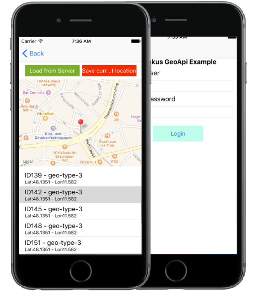

# odokus 3rd Party API Demo Application(iOS)

Simple project to demo the use of odokus 3rd party API calls in a XCode project. 



## Getting Started

These instructions will get you a copy of the project up and running on your local machine for development and testing purposes.

### Prerequisites

What things you need to install the software and how to install them

* XCode (install using Mac AppStore)
* CocoaPods (from Terminal: `sudo gem install cocoapods` )
* Checkout this XCode project and setup using the
* podfile within the projects root folder

```
pods install
```

* change `USER_NAME`and `PASSWORD`within LoginViewController.h/.m
* Build the project

### Using the API

For more info about how to use the API in your own project, head over to the [API project site](https://github.com/Hansenhof-electronic/dodokus-3rdParty-GeoAPI-for-iOS) here on [GitHub](https://github.com/Hansenhof-electronic/dodokus-3rdParty-GeoAPI-for-iOS).


## Authors

* **Johannes Dürr** - *Initial work* - [whileCoffee](https://whilecoffee.de)

## License

This project is licensed under the MIT License - see the [LICENSE.md](LICENSE.md) file for details

## Attribution

This project uses the work of other project groups in many essential areas, which I will name here, of course, and on whose project pages I would like to refer. Without the work of these people, it would not be possible to make this example project so insanely slim and easy to understand.

* [AFNetworking](https://github.com/AFNetworking/AFNetworking)
* [AFJSONRPCClient](https://github.com/AFNetworking/AFJSONRPCClient)
* [ProgressHUD](https://github.com/relatedcode/ProgressHUD)